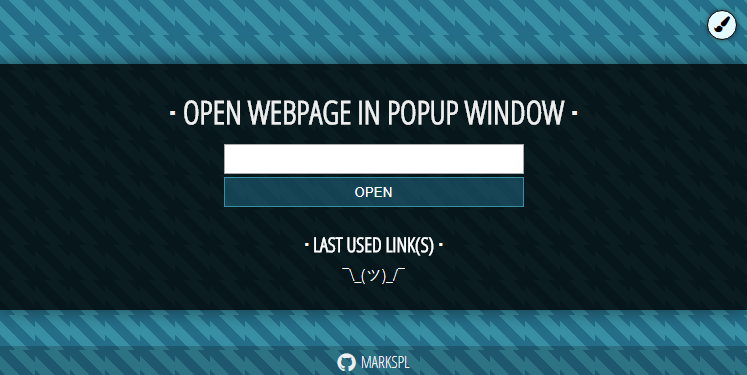

https://markspl.github.io

# popup-window-tool
Tool to open desired webpage on minimal popup window.

Old project which was created (back in 2018?) because I needed to open websites on compact popup window.

# features
- Uses `localstorate` to save previously used links
- Clean visited links
- Dark/White theme
- Report if the browser is different than Chrome (for fun, tested only on Chrome)
